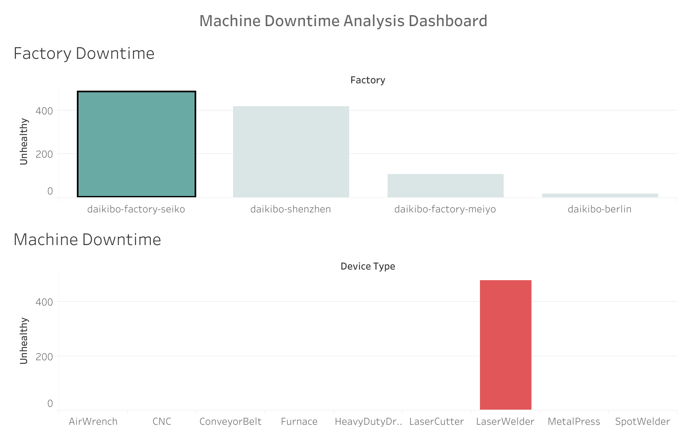

# Factory Downtime Analysis

## Overview

Daikibo Industrials collected telemetry data from 4 factories throughout May 2021. Each factory operates 9 machine types, reporting status every 10 minutes.

The objective was to:

- Identify the factory with the highest downtime
- Determine which machines contributed most to downtime in that location
- Present insights using an interactive Tableau dashboard

---

## Dataset

- 4 factories:
  - Daikibo Factory Meiyo (Tokyo, Japan)
  - Daikibo Factory Seiko (Osaka, Japan)
  - Daikibo Berlin (Berlin, Germany)
  - Daikibo Shenzhen (Shenzhen, China)
- 9 machine types per factory
- Telemetry data recorded every 10 minutes
- One month of data (May 2021)

---

## Methodology

1. Imported unified JSON telemetry file into Tableau.
2. Created a calculated field called **Unhealthy**:
   - Assigned value 10 to each unhealthy status (representing 10 minutes of downtime).
3. Aggregated downtime by:
   - Factory
   - Device Type
4. Built two visualizations:
   - Down Time per Factory
   - Down Time per Device Type
5. Created a dashboard with filtering enabled.

---

## Key Findings

- The Seiko factory experienced the highest total downtime.
- Within Seiko, the Laser Welder machine contributed the most downtime.
- Downtime patterns indicate equipment-specific issues rather than evenly distributed failures.

These findings allow management to prioritize maintenance and investigate high-risk equipment.

---

## Tools Used

- Tableau
- JSON telemetry dataset
- Calculated fields
- Dashboard interactivity

---

## Dashboard Screenshot

